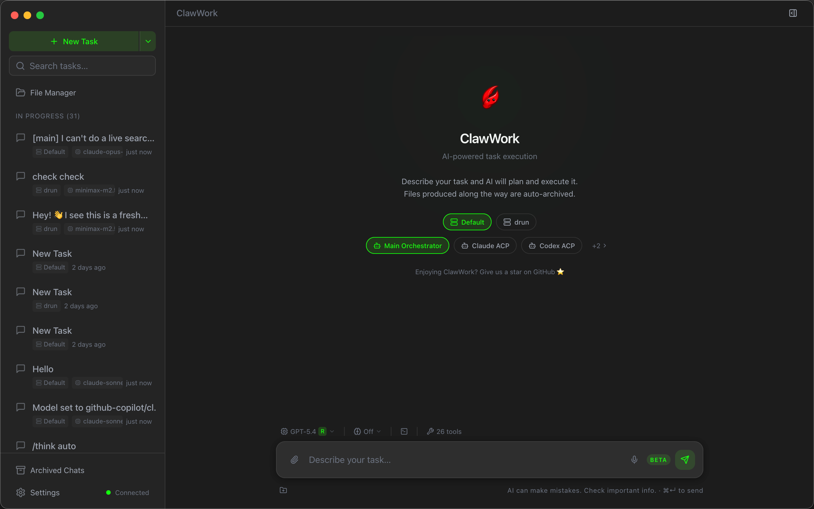
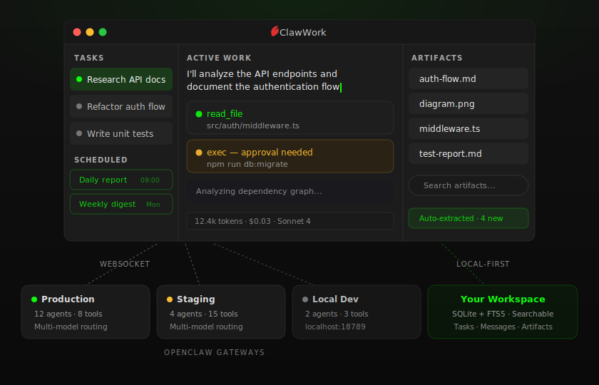

<div align="center">

<table border="0" cellspacing="0" cellpadding="0"><tr>
<td></td>
<td></td>
</tr></table>

[English](./README.md) · [简体中文](./README.zh.md) · [繁體中文](./README.zh-TW.md) · **日本語** · [한국어](./README.ko.md)

# ClawWork

**Agent OS 時代のための、ローカルファースト・ワークスペース。**

[OpenClaw](https://github.com/openclaw/openclaw) のデスクトップクライアント —— エージェントのタスクを並列実行し、アーティファクトを永続化し、ファイルを見失わない。

[](https://github.com/clawwork-ai/clawwork/releases/latest)
[](LICENSE)
[](https://github.com/clawwork-ai/clawwork)

[ダウンロード](#ダウンロード) · [**PWA**](https://cpwa.pages.dev) · [クイックスタート](#クイックスタート) · [Teams](#teams) · [機能一覧](#機能一覧) · [データとアーキテクチャ](#データとアーキテクチャ) · [リポジトリ構成](#リポジトリ構成) · [Roadmap](#roadmap) · [コントリビュート](#コントリビュート) · [Keynote](https://clawwork-ai.github.io/ClawWork/keynote/)

</div>

> **⚠️ 公式リポジトリ**
> これは ClawWork の**公式**プロジェクトです: https://github.com/clawwork-ai/clawwork
>
> ClawWork の名称を無断使用した類似リポジトリ (ClawWorkAi/ClawWork) と類似サイト (clawworkai.store) が見つかっています。上記の公式リンクをご利用ください。
>
> 公式サイト: https://clawwork-ai.github.io/ClawWork/

> **📝 翻訳ステータス**
> この日本語訳はコミュニティによるドラフト版です。不自然な表現が残っている可能性があります。ネイティブスピーカーによるレビューと [Pull Request](https://github.com/clawwork-ai/clawwork/pulls) を歓迎します。

## なぜ ClawWork なのか

**エージェントは増え続けている。ボトルネックはもはや能力ではなく、オペレーターの操作面だ。**

Agent Runtime が次々と登場する中、ユーザーはチャットウィンドウ、Web UI、ターミナルを行き来させられ、それぞれが独自のコンテキストを持ち、共有メモリは存在しない。IDE がコードのオペレーター層となり、ターミナルが Unix のオペレーター層となったように、Agent OS にもワークスペース層が必要だ。ClawWork はまさにその層を築いている —— OpenClaw の最良のクライアントとして出発し、マルチランタイムの未来へと拡張していく。

### 今： OpenClaw を、チャット履歴の沼から救う

OpenClaw は強力だが、プレーンなチャットは、その実力を容れるには悪い器だ。

複数セッション、長時間実行ジョブ、承認待ち、生成されたファイル、繰り返し実行される自動化、複数のゲートウェイ —— これらが重なった瞬間、チャット履歴は泥沼になる。ステータスが消える。ファイルが消える。コンテキストが消える。

ClawWork はそれを解決する。タスクはすべて、独立したセッション・アーティファクト・制御・履歴を持つ永続的なワークスペースとなり、3 ペインのレイアウトに配置される: 左はタスク一覧、中央は進行中の作業、右はアーティファクトとコンテキスト。

## Teams

1 体のエージェントは便利。協調するエージェントチームは、労働力になる。

ClawWork Teams は、複数のエージェントを 1 つのデプロイ可能な単位にまとめる —— ロール、パーソナリティ、スキル、ワークフローを含めて。**Coordinator** エージェントがタスクを分解し、**Worker** エージェントに委譲する。各 Worker は自分のサブセッションで動き、あなたはその全オーケストレーションをリアルタイムに観察できる。

```
skill → agent → team
```

### Team の構造

```
teams/clawwork-dev/
├── TEAM.md                  # チームのメタデータとワークフロー
└── agents/
    ├── manager/             # coordinator —— チームを統括
    │   ├── IDENTITY.md      # ロールとプロンプト
    │   ├── SOUL.md          # パーソナリティとスタイル
    │   └── skills.json      # スキル依存
    ├── architect/            # worker —— 設計を担当
    ├── frontend-dev/         # worker —— UI を構築
    ├── core-dev/             # worker —— コアロジックを構築
    └── ...
```

### Team を手に入れる 3 つの方法

- **[TeamsHub](https://github.com/clawwork-ai/teamshub-community)** —— Git ネイティブなレジストリから、コミュニティ製の Team を探してインストール。
- **手動で作る** —— ウィザードで Agent、アイデンティティ、スキルを段階的に定義。
- **AI Builder** —— やりたいことを言葉で説明すると、LLM が Team の構造、ロール、プロンプトを設計してくれる。

インストール後は、タスク作成時に Team を選ぶだけ。Coordinator が後を引き継ぐ。

## ダウンロード

### Homebrew (macOS)

```bash
brew tap clawwork-ai/clawwork
brew install --cask clawwork
```

### リリース版

macOS、Windows、Linux のビルド済みバイナリは [Releases ページ](https://github.com/clawwork-ai/clawwork/releases/latest) から入手できます。アプリは自動アップデート —— バックグラウンドで新バージョンをダウンロードし、終了時にインストールします。

### PWA (ブラウザ)

インストール不要 —— モダンブラウザで **[cpwa.pages.dev](https://cpwa.pages.dev)** を開くだけ。デスクトップとモバイルの両方で動作し、ホーム画面に追加できます。

## クイックスタート

1. OpenClaw Gateway を起動する。
2. ClawWork を開き、設定から gateway を追加。token、パスワード、またはペアリングコードで認証する。デフォルトのローカルエンドポイント: `ws://127.0.0.1:18789`。
3. タスクを作成し、gateway とエージェントを選び、作業内容を記述する。
4. チャットする: メッセージ送信、画像添付、`@` によるファイル参照、`/` コマンド。
5. タスクの実行を追い、ツールの動きを確認し、出力ファイルを手元に残す。

## 機能一覧

### ⚡ タスクファーストなワークフロー

- タスクを並列実行、それぞれが独立した OpenClaw セッション —— アーカイブしたタスクは後で再開可能
- gateway ごとのセッションカタログ
- 実用的なセッション制御: 停止、リセット、圧縮、削除、同期
- バックグラウンドの作業が読みやすく、1 本の長いスレッドに潰れない
- `cron`、`every`、`at` 式でタスクをスケジュール —— プリセットから選ぶか自前で書き、実行履歴を確認し、いつでも手動トリガー可能
- セッションを Markdown にエクスポートして、アプリ外にクリーンな記録を残す

### 👁 ひと目でわかる

- リアルタイムのストリーミング応答
- エージェントの作業中にインラインで表示されるツール呼び出しカード
- サイドパネルに進捗とアーティファクト
- 使用状況が一目でわかる —— gateway ごとの使用状況、セッションごとのコスト内訳、30 日ローリングのダッシュボード

### 🎛 より良いコントロール

- マルチ gateway 対応
- タスクごとにエージェントとモデルを切り替え
- エージェントを直接管理 —— アプリを離れずに作成、編集、削除、ワークスペース内ファイルの閲覧
- 各 gateway のツールカタログを閲覧して、エージェントが触れる範囲を把握
- 思考レベルの制御と slash コマンド
- 機微な実行操作には事前承認プロンプト
- バックグラウンドの出来事を通知 —— タスク完了、承認要求、gateway の切断 —— 通知をクリックすればタスクへジャンプ。イベント種別ごとにオン／オフでき、ノイズは自分で制御できます。

### 📂 より良いファイル処理

- 実用的なコンテキスト: 画像、`@` ファイル参照、音声入力、監視フォルダ
- 最大 10 フォルダを監視、変更を自動検出して再インデックス —— コンテキストは常に最新
- ローカルへのアーティファクト保存
- アシスタント応答内のコードブロックとリモート画像を自動抽出してワークスペースに保存 —— 手動コピペ不要
- タスク、メッセージ、アーティファクトを横断する全文検索

### 🖥 より良いデスクトップ体験

- システムトレイ対応
- グローバルショートカットで呼び出せるクイックランチャーウィンドウ (既定 `Alt+Space`、カスタマイズ可)
- アプリ全体でキーボードショートカット
- バックグラウンドで自動アップデート —— 設定画面で進捗を確認でき、終了時にインストール
- 読みやすさに合わせて UI をズーム、設定は記憶される
- ライト／ダークテーマ + 8 言語対応

### 🔧 デバッグ

- 何か起きたときに、デバッグバンドル (ログ、gateway ステータス、機密を除いた設定) をエクスポート —— バグ報告に便利
- 接続中の Gateway サーバーのバージョンを設定画面に表示

## データとアーキテクチャ

ClawWork は単一の Gateway WebSocket 接続で OpenClaw と通信します。タスクごとに独自のセッションキーを持って隔離され、すべてのデータはあなたが選んだローカルのワークスペースディレクトリに保存されます —— クラウド同期なし、外部データベースなし。

- **Tasks** —— タスクごとに独立した OpenClaw セッションが 1 対 1 で対応。並列作業が衝突しない。
- **Messages** —— ユーザー／アシスタント／システムメッセージ (ツール呼び出しや画像添付を含む) をすべてローカル永続化。
- **Artifacts** —— エージェントが生成したコードブロック、画像、ファイル。アシスタント出力から自動抽出されるので失われない。
- **全文検索** —— 上記すべてを横断検索。どのタスクだったか忘れた 3 週間前のスニペットも見つけ出せます。

<div align="center">

</div>

## リポジトリ構成

```
packages/shared/       — プロトコル型、定数 (依存ゼロ)
packages/core/         — 共有ビジネスロジック: stores、services、ports
packages/desktop/
  src/main/            — Electron メイン: gateway WS、IPC、DB、artifacts、OS 連携
  src/preload/         — 型付き window.clawwork ブリッジ
  src/renderer/        — React UI: components、layouts、stores、hooks、i18n
packages/pwa/          — Progressive Web App (ブラウザ + モバイル)
docs/                  — 設計ドキュメント、アーキテクチャ不変条件
e2e/                   — Playwright E2E テスト (スモーク + gateway 統合)
scripts/               — ビルドとチェック用スクリプト
website/               — プロジェクトサイト (React + Vite)
keynote/               — プレゼン資料 (Slidev)
```

## 技術スタック

Electron 34、React 19、TypeScript、Tailwind CSS v4、Zustand、SQLite (Drizzle ORM + better-sqlite3)、Framer Motion。

## プラットフォームに関する注意

- 音声入力にはローカルの [whisper.cpp](https://github.com/ggerganov/whisper.cpp) バイナリとモデルが必要です。
- 自動アップデートはパッケージ版のみ有効。開発モードではスキップされます。
- コンテキストフォルダ監視: 最大 10 ディレクトリ、深さ 4 階層、ファイルサイズ 10 MB まで。

## Roadmap

### ✅ リリース済み

- タスクごとのセッション隔離による並列実行
- マルチ gateway 認証 (token、パスワード、ペアリングコード)
- cron スケジュールタスク + 実行履歴
- gateway とセッションを横断する使用量／コストダッシュボード
- タスク、メッセージ、アーティファクトを横断する全文検索
- Teams と TeamsHub —— マルチエージェント編成の構築、共有、インストール
- Skills (ClawHub 経由) —— 発見とインストール
- AI Builder —— LLM による Team 作成補助
- PWA のオフラインサポートとモバイル UI ([cpwa.pages.dev](https://cpwa.pages.dev))
- クロスプラットフォーム: macOS、Windows、Linux (AppImage + deb)、自動アップデート付き

### 🔮 次に来るもの

- 会話のブランチ分岐
- アーティファクトの diff ビュー
- カスタムテーマ
- 繰り返しワークフローのためのセッションテンプレート
- Skills、Teams、Adapters の拡張 API ドキュメント

### 🌐 ビジョン —— Agent OS のワークスペース層

ClawWork は現時点では OpenClaw に最適化されています。私たちが目指すのは、ワークスペース層がランタイム非依存になる未来 —— ひとつのオペレーター面で、あなたが触れるあらゆるエージェントを扱えるようにする。

- **マルチランタイム・アダプタ** —— 他のランタイムのエージェントを、同一の task / session / artifact モデルに取り込む
- **より豊かなチームオーケストレーション** —— coordinator / worker を超える協調パターン
- **エンタープライズ対応のローカルファースト** —— ローカルデータの所有権を手放さずに、より強いデータ境界とチーム協働パターンを提供

項目はスコープが固まると _次に来るもの_ へ上がります。このセクションは時期の約束ではありません。

## Star History

[](https://www.star-history.com/?repos=clawwork-ai%2FClawWork&type=date&legend=top-left)

## コントリビュート

参加方法:

- セットアップとプロジェクト構成は [DEVELOPMENT.md](DEVELOPMENT.md) を参照
- [Issues](https://github.com/clawwork-ai/clawwork/issues) を確認
- [Pull Request](https://github.com/clawwork-ai/clawwork/pulls) を作成
- 提出前に `pnpm check` を実行 —— lint、アーキテクチャ、UI 契約、レンダラー文言、i18n、デッドコード、フォーマット、型、テストをまとめてチェックします。

翻訳は英語版より遅れることがあります。ズレを見つけたら PR を歓迎します。

## License

[Apache 2.0](LICENSE)

<div align="center">

[OpenClaw](https://github.com/openclaw/openclaw) のために作られています。[Peter Steinberger](https://github.com/steipete) の素晴らしい仕事に敬意を表して。

</div>
