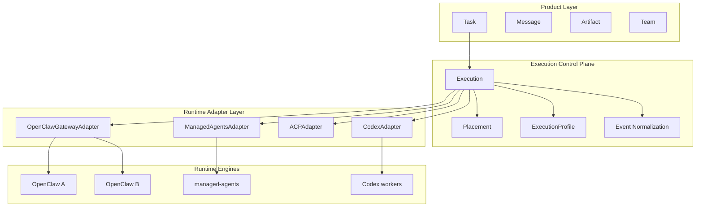

# AgentOS: From Single-Runtime Desktop Client to a Task-First Multi-Runtime Operator Surface

> ClawWork is the operator UX.
> The control plane owns execution governance.
> The runtime owns actual execution.

The long-term framing ClawWork is **the Workspace layer of the Agent OS** — the IDE is the operator layer for code, the Terminal is the operator layer for Unix, and the Agent OS era needs a workspace layer that plays the same role for agent work.

But today's ClawWork is still an "OpenClaw desktop client": one workspace can only host one runtime. Between that and the Vision bullet — **Multi-runtime adapters — bring agents from other runtimes into the same task / session / artifact model** — there's a structural gap.

This post is about how to cross that gap.

## Why now

As an early instance of the Agent OS workspace layer, ClawWork's execution model today is still built around a single runtime:

- one primary `Task`
- one primary OpenClaw session
- optional subagent sessions
- local-first desktop UX (task switching, message persistence, artifact management)

> This model holds up through v0.0.14.

TaskRoom and Teams reinforced the "one Task drives a set of subagent sessions" runtime model — Conductor / Performer / session-sync / room-store are already solid.

But once the following goals show up, it becomes a structural limit:

- connecting to multiple OpenClaw instances simultaneously
- supporting heterogeneous execution engines (Codex, Claude Code, Hermes-style runtimes)
- cross-engine dispatch via ACP
- scheduling based on runtime capability, cost, approval, and recovery policy

## What ACP solves, and what it does not

The hard part here is not transport.

ACP gives us:

- connectivity
- call format
- capability exposure

But ACP does not solve these control-plane problems:

- execution lifecycle
- retry and recovery
- scheduling and placement
- approval routing
- quota and budget constraints
- cross-runtime event normalization
- execution-tree observability and audit
- capability-based orchestration

If ClawWork keeps binding product logic directly to OpenClaw session semantics, the renderer and core layers will absorb more and more runtime-specific complexity, eventually devolving into a pile of special cases.

## A concrete example

Today's ClawWork assumes, directly or indirectly, in several places:

- `Task` maps directly to OpenClaw's `sessionKey`
- subagents are native OpenClaw sessions
- runtime events use the OpenClaw Gateway event format
- agent management capabilities come from Gateway RPC
- execution policy is mostly dictated by whichever Gateway is connected

All of these break down in a mixed-runtime future. A few examples:

- a Codex worker may expose `run` or `thread`, not an OpenClaw session
- a Claude Code-style worker may support filesystem and approval but lack `spawnedBy` semantics
- a Hermes-style runtime may have an entirely different lifecycle model and event stream
- even across multiple OpenClaw instances, models, skills, permissions, and plugin capabilities can diverge

Without an intermediate control plane, ClawWork would have to fork by runtime in many places: task routing, message sync, approval, room and performer tracking, team orchestration, artifact ownership, failure handling, usage accounting.

That is not a sustainable architecture.

## Three core objects

The Next-phase design collapses cleanly into three objects:

| Object             | Position                              | Responsibility                                                    |
| ------------------ | ------------------------------------- | ----------------------------------------------------------------- |
| **Task**           | primary user-facing object            | unchanged: title, intent, artifact, progress, archive             |
| **Execution**      | primary internal control-plane object | one governed execution unit — lifecycle, placement, cost, failure |
| **RuntimeAdapter** | backend integration boundary          | map runtime-native semantics onto a unified contract              |

The core change is a single sentence:

> `Task` is no longer internally defined as "one OpenClaw session."

Instead:

- a Task can map to one execution
- a Task can map to multiple executions
- a Task can include performers from multiple runtimes

Performer is no longer limited to an OpenClaw subagent — it generalizes to "user-visible worker projection." Any runtime that can run an agent can surface as a performer inside a Task.

The point of this layering is to formally separate **the workspace layer** from **the runtime layer**: Task / Message / Artifact are workspace semantics that the user sees; Execution and RuntimeAdapter are runtime-facing semantics that the user does not. Only once they are separated can a single workspace host multiple runtimes — which is the prerequisite for the workspace layer to outgrow its "single-runtime client" identity.

## Four-layer architecture

```text
Product Layer
  Task / Message / Artifact / Team
  Approval UI / Scheduler UI

Execution Control Plane
  Execution / Placement / ExecutionProfile
  Event Normalization / Recovery / Observability

Runtime Adapter Layer
  OpenClawGatewayAdapter
  ManagedAgentsAdapter
  ACPAdapter
  CodexAdapter
  ClaudeCodeAdapter
  HermesAdapter

Runtime Engines
  OpenClaw instances
  managed-agents deployments
  codex / claude-code / hermes workers
```



What the layers give us:

- **Product Layer** owns user-facing semantics. Task / Message / Artifact / Team stay the primary mental model.
- **Execution Control Plane** owns execution governance. Anything about "how did this execution go" lives here.
- **Runtime Adapter Layer** owns translation. It turns heterogeneous runtime-native semantics into a single contract.
- **Runtime Engines** own actual execution.

The main payoff: the product layer stops knowing about runtime-specific concepts. The renderer does not need to know whether something is OpenClaw's `spawnedBy` or Codex's `threadId` — it only needs to know "this is a performer of an execution."

## Three deployment modes

The architecture accommodates three deployment shapes at the same time:

### Mode A: Direct

```text
ClawWork -> OpenClaw Gateway
```

The current shape. Good for local, single-instance setups. The Next phase does not change any user-visible behavior on this path — it only puts a formal Adapter boundary behind it.

### Mode B: Managed

```text
ClawWork -> managed-agents -> OpenClaw
```

For setups that need stronger runtime governance. managed-agents already ships with execution isolation, quota, networking policy, session versioning, audit, and recovery-oriented state — ClawWork does not need to rebuild any of it.

### Mode C: Hybrid scheduling

```text
ClawWork -> Execution Control Plane -> {
  OpenClaw, managed-agents, Codex, Claude Code, Hermes, ...
}
```

The long-term target shape, supported by ACP. A single Task can contain performers from different runtimes, and orchestration decisions are handed to the control plane.

Keeping all three modes coexisting matters: Next is not "migrate everyone to Mode C." It's "make all three available, and let the user pick what fits."

## What a Runtime Adapter is

Adapter is the most important new abstraction in the Next phase. The goal is the smallest contract that covers every runtime:

```text
RuntimeAdapter
  getRuntimeInfo()
  getCapabilities()
  createExecution()
  cancelExecution()
  resumeExecution()
  sendInput()
  streamEvents()
  listChildren()
  listApprovals()
  resolveApproval()
  listArtifacts()
  getUsage()
  getHealth()
```

A few key constraints:

- **Keep the contract small.** A large contract inevitably forces runtimes to pretend to support semantics they don't, and the methods collapse into a pile of no-ops.
- **Centered on capabilities.** Different runtimes expose different capability sets; scheduling decisions are made against capabilities, not against brands.
- **Don't fake semantics.** If a runtime doesn't natively support approval, say so explicitly — "no approval" — instead of simulating a fake one.

### OpenClawGatewayAdapter

The first adapter to formalize. It's the compatibility path, and it's also the first piece of evidence that the contract is sufficient. The `RoomAdapter` abstraction mentioned in the Teams blog post is essentially the starting point for this — it already channels OpenClaw session calls through the three deps interfaces in core.

### ManagedAgentsAdapter

Maps managed-agents primitives onto the unified contract. This is high-leverage because managed-agents already owns a control-plane surface: execution isolation, quota, networking policy, session versioning, audit, recovery-oriented state.

### ACPAdapter

ACP occupies a subtle position: **it's the transport and capability-discovery layer, not a complete control plane.**

An ACP adapter can take care of:

- worker discoverability
- exposing callable tools
- exposing runtime metadata
- sending instructions and receiving events

But the ACP adapter should not replace:

- execution lifecycle ownership
- placement policy
- approval normalization
- cost and usage accounting

If this line isn't drawn clearly, the architecture collapses into the illusion that "ACP is everything."

### Engine-specific adapters

Where ACP is insufficient or unavailable, ClawWork can still supply dedicated adapters for specific engines — Codex, Claude Code, Hermes-style runtimes. Those adapters still have to terminate on the same internal contract.

## Capability set

Scheduling decisions should be made against capabilities, not runtime names. A minimal starting capability set for the Next phase:

- can stream text
- can natively support subagents
- can support approval
- can support MCP
- can access the filesystem
- can constrain the network
- can resume runs
- can produce an artifact manifest
- can report quota and usage

This is not a frozen list — it's a starting point. Real runtime integrations will reveal more dimensions, and the set grows as needed.

## Unified event model

Mixed-runtime support has to stand on a unified event model, or renderer and persistence will explode.

A proposed internal standard event set:

```text
execution.created
execution.started
execution.progress
execution.message.delta
execution.message.final
execution.thinking.delta
execution.tool.call
execution.tool.result
execution.approval.requested
execution.approval.resolved
execution.artifact.created
execution.warning
execution.error
execution.completed
execution.cancelled
execution.child.spawned
```

Each adapter is responsible for translating runtime-native events into this model. Direct payoffs:

- renderer logic stays stable — no runtime-switch anywhere
- `session-sync` can generalize into `execution-sync`, isolating on execution key instead of OpenClaw session key
- approval / observability pipelines are handled uniformly

There will be semantic drift here — no two runtimes will provide the same lifecycle signals. **Explicitly accepting that partial capabilities have partial fidelity** is more robust than pretending all runtimes share identical semantics.

## Where TaskRoom and Teams fit in the new architecture

The existing direction of TaskRoom and Teams still holds, but their positioning needs to be sharper:

| Object        | What it is               | What it is not                         |
| ------------- | ------------------------ | -------------------------------------- |
| **TaskRoom**  | collaboration projection | not a runtime, not a scheduling engine |
| **Execution** | runtime control object   | not a user UX concept                  |
| **Performer** | worker projection        | not a native object of any one runtime |

In other words:

- Room is not a runtime
- Room is not a session
- Room is not a scheduling engine

Room is just a user-facing collaboration view that projects one or more executions into a unified experience. Which means today's room-style UX can stay, and the backend can evolve toward multi-runtime underneath.

## Incremental rollout

No big-bang rewrite. The roadmap breaks into five phases, each independently shippable and independently revertible.

### Phase 0: Design only, no implementation

**Now.** Write the KEP clearly and align on it. No structural refactoring. The KEP becomes the design anchor that every related PR going forward can point back to.

### Phase 1: Formalize OpenClaw as an Adapter

Move the current direct Gateway execution path behind an explicit adapter boundary. Stop letting more core logic depend directly on OpenClaw session semantics.

**Hard constraint: no user-visible behavior change.**

Acceptance:

- the current single-OpenClaw flow still works
- core services no longer default to the OpenClaw wire protocol everywhere

This phase lines up with the `RoomAdapter` direction mentioned in the Teams blog — it pulls runtime-specific calls behind a unified interface.

### Phase 2: Introduce the Execution internal object

Add local persistence for `Execution` and `RuntimeSessionRef`. The UI layer's `Task` stays unchanged. Map the current task execution into a single execution record.

Acceptance:

- a Task can internally own multiple executions
- the UI remains entirely task-first

### Phase 3: Wire in a managed runtime backend

Ship `ManagedAgentsAdapter`. Let a task or profile pick direct mode or managed mode. Add minimal runtime selection and health checks.

Acceptance:

- a single ClawWork instance can use both direct OpenClaw and a managed runtime backend at the same time

### Phase 4: Support mixed-runtime routing

Add capability-based placement. Add non-OpenClaw runtime adapters. Support explicit or policy-driven delegation to specialized runtimes.

Acceptance:

- a single Task can coordinate execution across heterogeneous runtimes

At this point ClawWork actually becomes a runtime-agnostic workspace layer — and the README Vision line _one operator surface for every agent you touch_ gets its first real cash-out.

## Persistence strategy

The desktop stays local-first. The product-side primary state stays on-device:

- tasks
- task messages
- artifacts
- performers
- room projections
- local approval history

New local metadata introduced:

- executions
- runtime references
- execution profiles
- placement decisions
- normalized event checkpoints

Do not replace product state with purely remote orchestration state. The strong local model is the foundation of ClawWork and can't be traded away.

## Risks

### Over-abstracting too early

The biggest one. Inventing a runtime abstraction that "can represent anything" tends to end up meaning "nothing in particular" — this is the most common way this kind of KEP dies.

Mitigation:

- start from the existing OpenClaw path
- keep the adapter contract small
- only normalize the semantics the UI and the control plane actually need

### Turning ClawWork into an ops console

If runtime primitives leak heavily into the main UI, ClawWork loses its task-first product identity and becomes an `Agent / Environment / Session / Event`-style ops backend.

Mitigation:

- keep `Task` as the top-level object
- runtime objects stay internal by default
- only expose execution internals in advanced workflows or debugging contexts

### Event semantic drift

No two runtimes will offer identical lifecycle signals.

Mitigation:

- perform explicit event normalization
- accept partial fidelity where capabilities are partial
- don't pretend all runtimes share the same semantics

### Data model coupling

Today's code defaults to task-session coupling in multiple places. A single cross-layer rewrite would carry massive risk.

Mitigation:

- introduce execution objects before integrating new runtimes
- decouple incrementally — never attempt to rewrite every layer in one pass

## Minimal next step

No work scheduled yet.

When it actually starts, step one is:

> pull the current direct OpenClaw execution path behind a formal runtime adapter boundary, with zero user-visible behavior change.

This is the smallest, safest, highest-leverage first step. It won't give ClawWork multi-runtime support overnight — but it's the first time the workspace layer is genuinely decoupled from a runtime. Which is also the first step from "OpenClaw desktop client" toward "Agent OS workspace layer."

The full KEP lives at `design/kep-task-first-multi-runtime-control-plane.zh-CN.md`. PRs and challenges welcome.
