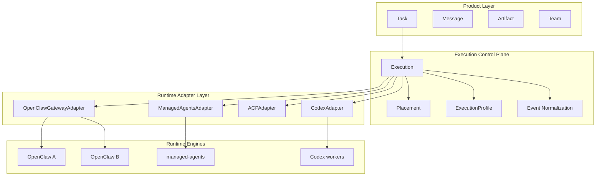

# AgentOS：从单 Runtime 桌面客户端到 Task-First 多 Runtime 操作台

> ClawWork 是 operator UX。
> 控制面负责执行治理。
> runtime 负责真正执行。

ClawWork 的下一站是 **the Workspace layer of the Agent OS**，IDE 是代码的操作者层，Terminal 是 Unix 的操作者层，Agent OS 时代需要一个同样承载工作流的 workspace 层。

但今天的 ClawWork 仍然是一个"OpenClaw 桌面客户端"：一个 workspace 只能挂一种 runtime。这和 Vision 里 **Multi-runtime adapters — bring agents from other runtimes into the same task / session / artifact model** 那一条之间，还隔着一段结构性的距离。

这篇讲的，就是这段距离怎么走。

## 为什么现在要思考这个

作为 Agent OS workspace 层的雏形，ClawWork 当前的执行模型仍然围绕单一 runtime 建立：

- 一个主 `Task`
- 一个主 OpenClaw session
- 可选的 subagent session
- 本地优先的桌面 UX（任务切换、消息持久化、artifact 管理）

> 这个模型直到 v0.0.14 都是成立的

TaskRoom 和 Teams 进一步夯实了"一个 Task 驱动一组 subagent session"的运行模型，Conductor / Performer / session-sync / room-store 已经很稳。

但当下面这些目标出现时，它会变成结构性限制：

- 同时连接多个 OpenClaw 实例
- 支持异构执行引擎（Codex、Claude Code、Hermes 类 runtime）
- 基于 ACP 做跨引擎分发
- 根据 runtime 能力、成本、审批和恢复策略做调度

## ACP 能解决什么，不能解决什么

这里真正难的不是 transport。

ACP 可以帮我们解决：

- 连通性
- 调用格式
- 能力暴露

但 ACP 解决不了下面这些控制面问题：

- execution lifecycle
- 重试与恢复
- 调度与 placement
- approval 路由
- 配额与预算约束
- 跨 runtime 的事件归一化
- 执行树的观测与审计
- 基于能力的编排

如果 ClawWork 继续把产品逻辑直接绑在 OpenClaw session 语义上，renderer 和 core 层会越来越多地吸收 runtime-specific 复杂度，最终演变成一堆特判。

## 一个具体的例子

今天的 ClawWork 在多个位置直接或间接地假设：

- `Task` 可以直接映射成 OpenClaw 的 `sessionKey`
- subagent 是 OpenClaw 原生 session
- runtime event 使用 OpenClaw Gateway 的事件格式
- agent 管理能力来自 Gateway RPC
- 执行策略主要由所连接的 Gateway 决定

这些假设在混合 runtime 未来里都会失效。几个典型例子：

- 一个 Codex worker 可能暴露的是 `run` 或 `thread`，而不是 OpenClaw session
- 一个 Claude Code 类 worker 可能支持 filesystem 和 approval，但没有 `spawnedBy` 语义
- 一个 Hermes 类 runtime 可能有完全不同的 lifecycle 模型和事件流
- 多个 OpenClaw 实例之间也可能存在不同的模型、技能、权限和插件能力

如果没有中间控制面，ClawWork 就不得不在很多地方按 runtime 分叉：task 路由、message 同步、approval、room 和 performer 追踪、team orchestration、artifact 归属、failure handling、usage accounting。

这不是可持续的架构。

## 三个核心对象

Next 阶段的设计可以用三个对象拎清楚：

| 对象               | 位置             | 职责                                                           |
| ------------------ | ---------------- | -------------------------------------------------------------- |
| **Task**           | 用户侧主对象     | 保持不变：title、intent、artifact、progress、archive           |
| **Execution**      | 内部控制面主对象 | 一次受治理的执行单元，负责 lifecycle、placement、cost、failure |
| **RuntimeAdapter** | 后端接入边界     | 把 runtime-native 语义映射到统一 contract                      |

核心变化只有一句话：

> `Task` 不再在内部被定义为"一个 OpenClaw session"。

取而代之：

- 一个 Task 可以对应一个 execution
- 一个 Task 也可以对应多个 execution
- 一个 Task 可以包含来自多个 runtime 的 performers

Performer 不再局限于 OpenClaw subagent，它泛化为"用户可见的 worker 投影"——只要某个 runtime 能跑 agent，它就能作为 performer 出现在 Task 里。

这种分层的要义，是把 **workspace 层** 和 **runtime 层** 正式拆开：Task / Message / Artifact 是 workspace 语义，用户看得到；Execution 和 RuntimeAdapter 是 runtime-facing 语义，用户看不到。只有拆开，同一个 workspace 才能同时承载多种 runtime——这是 workspace layer 跨越"单一 runtime 客户端"身份的必要条件。

## 四层架构

```text
Product Layer
  Task / Message / Artifact / Team
  Approval UI / Scheduler UI

Execution Control Plane
  Execution / Placement / ExecutionProfile
  Event Normalization / Recovery / Observability

Runtime Adapter Layer
  OpenClawGatewayAdapter
  ManagedAgentsAdapter
  ACPAdapter
  CodexAdapter
  ClaudeCodeAdapter
  HermesAdapter

Runtime Engines
  OpenClaw instances
  managed-agents deployments
  codex / claude-code / hermes workers
```



分层的意义：

- **Product Layer** 负责用户语义。Task / Message / Artifact / Team 继续是主心智，不变。
- **Execution Control Plane** 负责执行治理。所有"这次执行跑得怎么样"的事情都归它。
- **Runtime Adapter Layer** 负责翻译。把异构 runtime 的原生语义翻译成统一 contract。
- **Runtime Engines** 负责真正执行。

最主要的收益，是让产品层不再感知 runtime-specific 概念。renderer 不需要知道"这是 OpenClaw 的 `spawnedBy` 还是 Codex 的 `threadId`"，它只需要知道"这是一个 execution 的 performer"。

## 三种部署模式

这套架构允许同时支持三种部署形态：

### 模式 A：直连

```text
ClawWork -> OpenClaw Gateway
```

当前形态。适合本地、单实例场景。Next 阶段不改变这条路径的任何用户可见行为，只是把它放到一个正式的 Adapter 边界后面。

### 模式 B：受管

```text
ClawWork -> managed-agents -> OpenClaw
```

适合需要更强 runtime 治理的场景。managed-agents 自带 execution isolation、quota、networking policy、session versioning、audit、recovery-oriented state——ClawWork 不需要重造这一套。

### 模式 C：混合调度

```text
ClawWork -> Execution Control Plane -> {
  OpenClaw, managed-agents, Codex, Claude Code, Hermes, ...
}
```

ACP 辅助下的长期目标形态。一个 Task 内可以出现来自不同 runtime 的 performers，编排决策交给控制面。

三种模式共存很重要：Next 不是"把所有用户迁到模式 C"，而是"让三种模式都可用，让用户按需选择"。

## Runtime Adapter 是什么

Adapter 是 Next 阶段最核心的新抽象。目标是用最小的 contract 同时覆盖所有 runtime：

```text
RuntimeAdapter
  getRuntimeInfo()
  getCapabilities()
  createExecution()
  cancelExecution()
  resumeExecution()
  sendInput()
  streamEvents()
  listChildren()
  listApprovals()
  resolveApproval()
  listArtifacts()
  getUsage()
  getHealth()
```

几个关键约束：

- **contract 尽量小**。大了必然会强迫 runtime 假装支持它本来没有的语义，最终变成一堆 no-op。
- **以 capability 为中心**。不同 runtime 暴露不同的能力组合，调度决策基于 capability，不基于品牌。
- **不强装语义**。如果某个 runtime 原生不支持 approval，就明确地"没有 approval"，不模拟一套假的。

### OpenClawGatewayAdapter

第一个要正式化的 adapter。它是兼容路径，也是验证 contract 是否够用的第一块试金石。Teams 博客里提到的 `RoomAdapter` 抽象，本质上就是这条路径的起点——它已经把 OpenClaw 的 session 调用从 core 的三个 deps interface 里收口。

### ManagedAgentsAdapter

把 managed-agents 的原语映射成统一 contract。它很有价值，因为 managed-agents 已经拥有一套控制面能力：execution isolation、quota、networking policy、session versioning、audit、recovery-oriented state。

### ACPAdapter

ACP 有一个微妙的定位：**它是 transport 和 capability discovery 层，不是完整控制面**。

ACP adapter 可以负责：

- 发现可连接 worker
- 暴露 callable tools
- 暴露 runtime metadata
- 发送指令并接收事件

但 ACP adapter 不应该替代：

- execution lifecycle ownership
- placement policy
- approval normalization
- cost 和 usage accounting

这条线划不清，架构会塌成"ACP 就是一切"的幻觉。

### Engine-Specific Adapter

在 ACP 不足或不可用时，ClawWork 仍然可以为特定引擎提供直接 adapter，例如 Codex、Claude Code、Hermes 类 runtime。但这些 adapter 仍然必须落到同一个内部 contract 上。

## 能力清单

调度决策应该基于 capability，不是 runtime 名。Next 阶段最小的 capability 集合大概是这些：

- 能否 stream text
- 能否原生支持 subagents
- 能否支持 approval
- 能否支持 MCP
- 能否访问 filesystem
- 能否限制 network
- 能否 resume run
- 能否产出 artifact manifest
- 能否上报 quota 和 usage

这不是一次性敲定的清单，是一个起点。真实 runtime 接入后会发现更多 capability 维度，再按需扩展。

## 统一事件模型

混合 runtime 支持必须建立在统一事件模型之上，否则 renderer 和 persistence 层会爆炸。

内部标准事件类型建议：

```text
execution.created
execution.started
execution.progress
execution.message.delta
execution.message.final
execution.thinking.delta
execution.tool.call
execution.tool.result
execution.approval.requested
execution.approval.resolved
execution.artifact.created
execution.warning
execution.error
execution.completed
execution.cancelled
execution.child.spawned
```

每个 adapter 负责把 runtime-native 事件翻译成这套模型。直接收益：

- renderer 逻辑稳定，不用 switch runtime
- `session-sync` 可以泛化为 `execution-sync`，按 execution key 而不是 OpenClaw session key 隔离
- approval / observability pipeline 统一处理

这里会有语义漂移——不同 runtime 不可能提供完全相同的 lifecycle signal。**显式接受部分能力只有部分 fidelity**，比假装所有 runtime 语义一致更健壮。

## Task Room 与 Teams 在新架构里的位置

TaskRoom 和 Teams 的现有方向仍然成立，但定位需要更精确：

| 对象          | 是什么                   | 不是什么                               |
| ------------- | ------------------------ | -------------------------------------- |
| **TaskRoom**  | collaboration projection | 不是 runtime，也不是 scheduling engine |
| **Execution** | runtime control object   | 不是用户 UX 概念                       |
| **Performer** | worker projection        | 不是某一 runtime 的原生对象            |

也就是说：

- Room 不是 runtime
- Room 不是 session
- Room 不是 scheduling engine

Room 只是一个面向用户的协作视图，把一个或多个 execution 投影成统一体验。这意味着当前的 room-like UX 可以继续保留，backend 可以逐步演进为多 runtime。

## 渐进式落地

不做大重写。路线图拆成五个阶段，每阶段都可以独立交付、独立回滚。

### Phase 0：只设计，不实现

**现在。** 写清楚并对齐 KEP，不做结构性重构。把 KEP 作为后续工作的设计锚点，让后面每个相关 PR 都能引用同一份参照。

### Phase 1：把 OpenClaw 变成正式 Adapter

把当前 direct Gateway execution path 抽到明确 adapter 边界后面。停止让更多核心逻辑继续直接依赖 OpenClaw session 语义。

**硬约束：所有用户可见行为不变。**

验收：

- 当前单 OpenClaw 流程继续可用
- core services 不再到处默认 OpenClaw 线协议

这一阶段跟 Teams 博客里提到的 `RoomAdapter` 方向是一致的——把 runtime-specific 调用抽到一个统一 interface 后面。

### Phase 2：引入 Execution 内部对象

新增 `Execution` 和 `RuntimeSessionRef` 的本地持久化。UI 层的 `Task` 不变，把当前 task execution 先映射成一条 execution 记录。

验收：

- 一个 Task 在内部可以拥有多个 execution
- UI 仍然完全 task-first

### Phase 3：接入 Managed Runtime Backend

实现 `ManagedAgentsAdapter`。允许 task 或 profile 选择直连模式或受管模式。增加最小 runtime 选择与健康检查能力。

验收：

- 一个 ClawWork 实例能同时使用 direct OpenClaw 和 managed runtime backend

### Phase 4：支持 Mixed Runtime Routing

增加 capability-based placement。增加非 OpenClaw runtime adapter。支持显式或策略驱动的专业 runtime 委派。

验收：

- 一个 Task 能跨异构 runtime 协同执行

到这一步，ClawWork 才真正成为 runtime-agnostic 的 workspace 层——README Vision 里那句 _one operator surface for every agent you touch_ 第一次兑现。

## 数据持久化策略

桌面端仍然 local-first。产品侧主状态继续保存在本地：

- tasks
- task messages
- artifacts
- performers
- room projections
- local approval history

新增的本地元数据：

- executions
- runtime references
- execution profiles
- placement decisions
- normalized event checkpoints

不要把产品状态替换成纯远端 orchestration state。桌面端的强本地模型是 ClawWork 的底色，不能丢。

## 风险

### 过早过度抽象

最大的风险。发明一个"什么都能表示"的 runtime 抽象，最后变得空泛而不可实现，是这类 KEP 最常见的死法。

缓解：

- 从现有 OpenClaw 路径出发
- adapter contract 尽量小
- 只归一化 UI 和控制面真正需要的语义

### 把 ClawWork 做成后台控制台

如果 runtime primitive 大量泄漏到主 UI，ClawWork 会失去 task-first 的产品身份，变成一个 `Agent / Environment / Session / Event` 风格的运维后台。

缓解：

- 继续保持 `Task` 为顶层对象
- runtime 对象默认内部化
- 只有在高级工作流或调试场景才显式暴露执行细节

### 事件语义漂移

不同 runtime 不可能提供完全相同的 lifecycle signal。

缓解：

- 显式做 event normalization
- 接受部分能力只有部分 fidelity
- 不强装所有 runtime 拥有相同语义

### 数据模型耦合

当前代码在多个位置默认 task-session 耦合。一次改穿所有层会引入巨大风险。

缓解：

- 在接入新 runtime 之前，先引入 execution objects
- 渐进拆耦，不要试图一次性改穿所有层

## 最小下一步

当前不要求开工。

等真正开始时，第一步是：

> 把当前 direct OpenClaw execution path 抽到一个正式的 runtime adapter 边界后面，且不改变任何用户可见行为。

这是最小、最稳、最有价值的第一步。它不会让 ClawWork 立刻支持多 runtime，但它让 workspace 层第一次真正与 runtime 解耦——也是从"OpenClaw 桌面客户端"迈向"Agent OS workspace layer"的第一步。

完整 KEP 在 `design/kep-task-first-multi-runtime-control-plane.zh-CN.md`。欢迎 PR 和 challenge。
